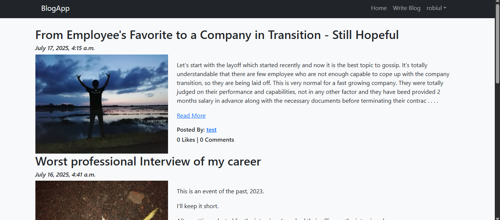
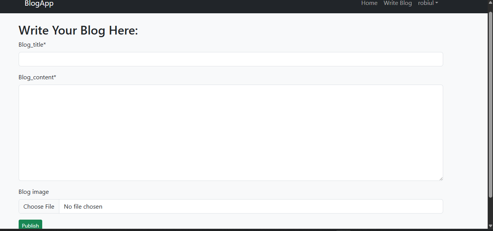
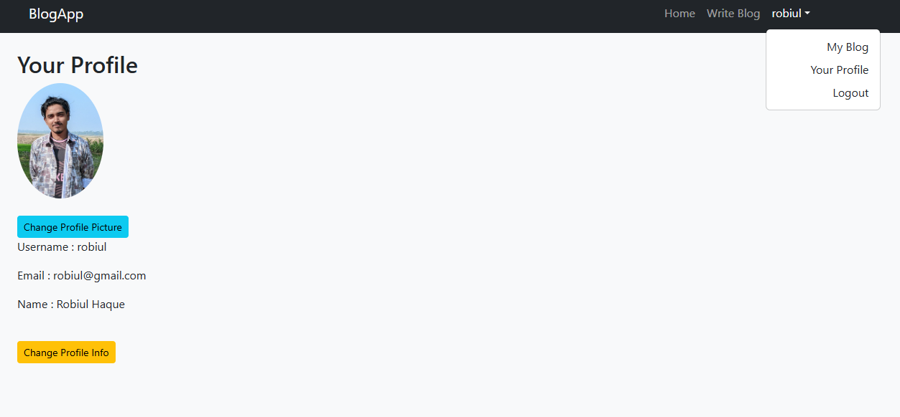

# BlogApp

A full-featured Django blog application with user authentication, profiles, blog posts, comments, likes, and image uploads.

---

## 🚀 Features

- User signup, login, logout with secure authentication  
- User profile management with profile pictures  
- Create, edit blog posts with images  
- Auto-generated unique slugs with Unicode support  
- Comment and Like system with live counts  
- Responsive UI using Bootstrap 5  
- Media upload handling (profile pics, blog images)  

---

## 📦 Installation & Setup

### Prerequisites

- Python 3.8+  
- MySQL Server  
- Git  

### Steps

1. Clone the repo

    ```bash
    git clone https://github.com/yourusername/blogapp.git
    cd blogapp
    ```

2. Create and activate a virtual environment

    ```bash
    # Linux/Mac
    python -m venv env
    source env/bin/activate

    # Windows
    python -m venv env
    env\Scripts\activate
    ```

3. Install dependencies

    ```bash
    pip install -r requirements.txt
    ```

4. Create a `.env` file in the root directory :

    ```
    DEBUG=True
    SECRET_KEY=your_secret_key_here
    DB_NAME=your_database_name
    DB_USER=your_database_user
    DB_PASSWORD=your_database_password
    DB_HOST=localhost
    DB_PORT=3306
    ```

5. Run migrations

    ```bash
    python manage.py makemigrations
    python manage.py migrate
    ```

6. Create a superuser

    ```bash
    python manage.py createsuperuser
    ```

7. Collect static files

    ```bash
    python manage.py collectstatic
    ```

8. Run the development server

    ```bash
    python manage.py runserver
    ```

---
## 🖼️ Blog Screenshots

### 🏠 Home Page


### 📝 Write Blog Post


### 💬 Profile Section



## 💻 Usage

- Register a user account  
- Login and access profile settings  
- Create blog posts with images and rich text content  
- View and comment on posts  
- Like/unlike posts  
- Edit your own blog posts  

---

## ⚙️ Technologies Used

- Django 5.x  
- Python 3.8+  
- MySQL  
- Bootstrap 5  
- FontAwesome Icons  
- dotenv for environment variables  
